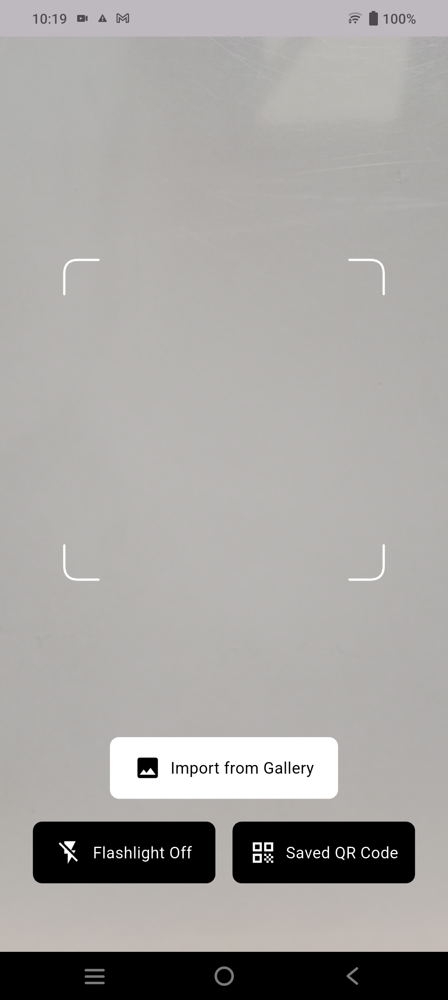
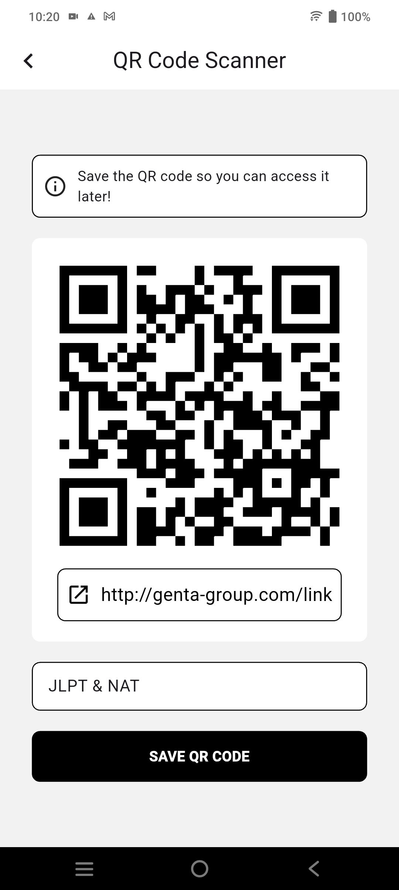
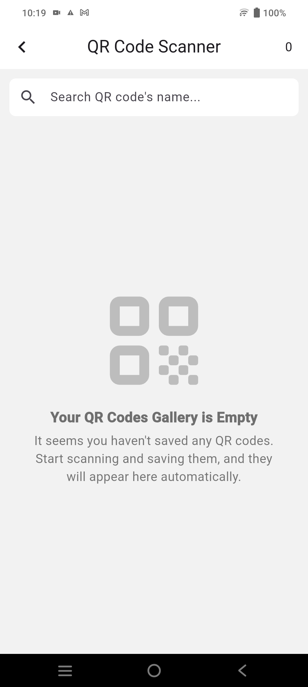
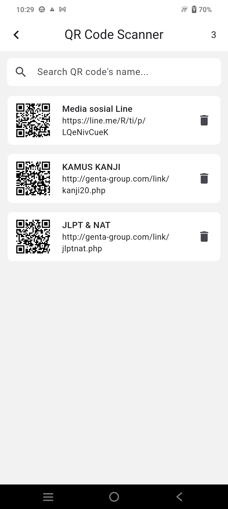
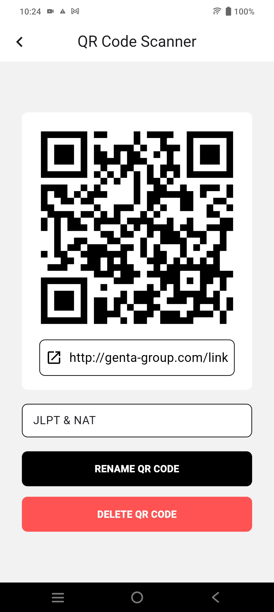
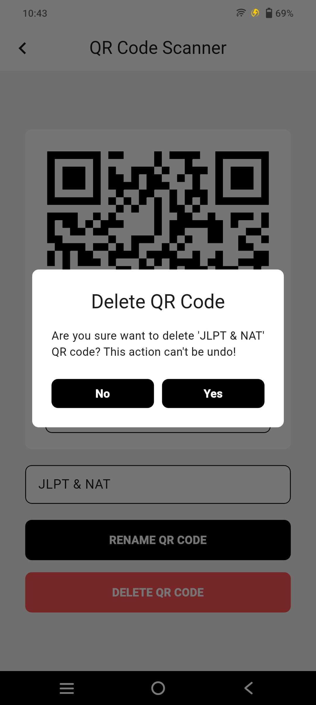

  

# QR Code Scanner

QR Code Scanner adalah aplikasi Android yang memungkinkan pengguna untuk melalukan scan pada kode QR dan menyimpan kode QR QR tersebut.

## Mengunduh Aplikasi

Untuk mengunduh aplikasi Anda dapat menuju menu rilis pada repositori ini. Pada menu rilis tersebut Anda dapat memilih versi aplikasi yang ingin digunakan.

Pada setiap rilis versi aplikasi, disediakan 3 file apk yang berbeda, yaitu arm64-v8a, armeabi-v7a, dan x86_64. Anda dapat mengunduh salah satu dari ketiga file apk tersebut.

* **arm64-v8a**: Ponsel Android modern (Rekomendasi)
* **armeabi-v7a**: Ponsel Android lama
* **x86_64**: Untuk beberapa perangkat tertentu

## Fitur-Fitur

- Melakukan scan kode QR melalui kamera
- Menyalakan senter ketika melakukan scan
- Melakukan scan kode QR pada gambar yang tersimpan di galeri
- Menyimpan kode QR, dengan memberikan nama pada kode QR tersebut
- Mengganti nama kode QR yang disimpan
- Menghapus kode QR yang disimpan
- Melihat banyak kode QR yang disimpan

# Tangkapan Layar

|| |

|||

|||
